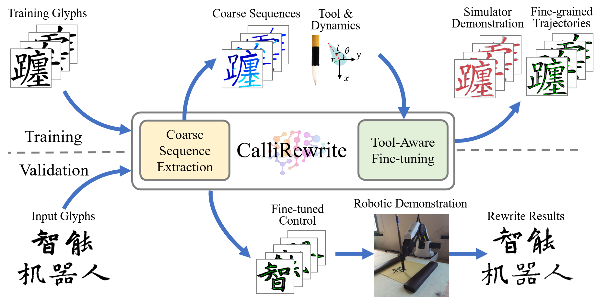

<h2 align="center">
  <b>CalliRewrite: Recovering Handwriting Behaviors from Calligraphy Images without Supervision</b>

  <b><i>ICRA 2024</i></b>


<div align="center">
    <a href="TODO-PAPER-ARXIV-LINK" target="_blank">
    </a>
    <a href="https://luoprojectpage.github.io/callirewrite.github.io/" target="_blank">
    </a>
</div>
</h2>

This is the repository of [**CalliRewrite: Recovering Handwriting Behaviors from Calligraphy Images without Supervision**](TODO-PAPER-ARXIV-LINK).

CalliRewrite is an unsupervised approach enabling low-cost robotic arms to replicate diverse calligraphic 
glyphs by manipulating different writing tools. We use fine-tuned unsupervised LSTM to perform coarse stroke segmentation, and refine them through a reinforcement learning method to produce 
fine-grained control.

For more information, please visit our [**project page**](https://luoprojectpage.github.io/callirewrite.github.io/).




## 📬 News

- **2024.2.25** Version 1.0 upload

## How to Use Our Code and Model:
We release our network and checkpoints. You can setup the pipeline under the following guidance.

### 0. Install dependencies
Due to package version dependencies, we need to set up two separate environments for coarse sequence extraction and tool-aware finetuning. To do this, you can follow these steps:

1. Navigate to the directory for coarse sequence extraction:
   ```bash
   cd seq_extract
   ```

2. Create a new conda environment using the specified requirements file:
   ```bash
   conda env create -f environment.yml
   ```

3. Activate the newly created environment (optional):
   ```bash
   conda activate calli_ext
   ```
   
4. Navigate to the directory for sequence fine-tuning:
   ```bash
   cd ../rl_finetune
   ```

5. Create another new conda environment using the requirements file for fine-tuning:
   ```bash
   conda env create -f environment.yml
   ```

6. Activate the second newly created environment:
   ```bash
   conda activate callli_rl
   ```
   
7. Follow **modify_env.md** and correct some flaws in the packages (Necessary!):
   
By following these steps, you will have two separate conda environments configured for coarse sequence extraction and sequence fine-tuning, ensuring that the correct dependencies are installed for each task.

### 1. Caliberate your own writing utensil

We provide three simple tools for modeling in the reinforcement learning environment: **Calligraphy brush**, **fude pen**, and **flat tip marker**. The geometry and dynamic properties are defined in `./rl_finetune/Callienv/envs/tools.py` and folder `./rl_finetune/tool_property/`. For robotic demonstration please callibrate the properties to bridge the sim-to-real gap. You can also define your own utensil easily.

For calibrating the geometric properties, we provide a control script using the Dobot Magician robotic arm that models the $r-z$ correspondence.

### 2. Download pretrained models

### 3. Coarse Sequence Extraction

### 4. Tool-Aware Finetuning
You can call the function to easily move inferenced sequences along with the images to `./rl_finetune/data/train_data' and `./rl_finetune/data/test_data'. Remember the number of train/test envs must be a divisor of the number of train/test data.
   ```bash
   conda activate calli_rl
   cd ..
   python move_data
   cd rl_finetune
   ```
Then you can have an easy startup:
   ```bash
   bash ./scripts/train_brush.sh
   ```

### 5. Visualization and robotic demonstration

## Train on your own data


## Citation
